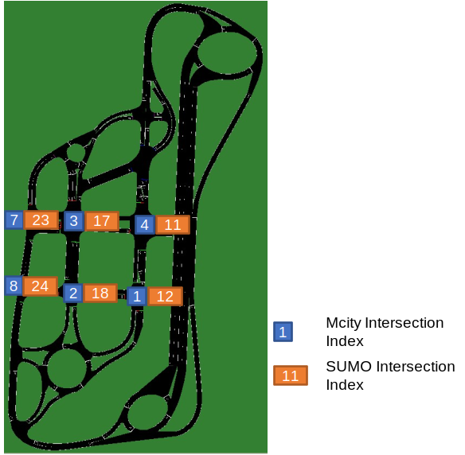

Mcity AR System
===================

The simulator object will first request vehicle information and traffic light information from the Mcity test track. Then, the received messages will be decoded and parsed by our simulation platform. With the up-to-date information, the AV controller will send real-time control commands to the SUMO simulation platform through Traci and finally update the vehicle states and signal states immediately. We are also able to record the vehicle trajectory for further analysis.

Signal Synchronization
-----------------------
The following figure shows the relationship between Mcity intersection index and the intersection index in SUMO network. The signal controller will request the phase information for all the six traffic lights in Mcity, which is an array of integer ('1' represents red light, '4' represents yellow light, and '3' represents green light). After decoding the information into an array of characters ('r' represents red light, 'y' represents yellow light, and 'G' represents green light), the signal states are set based on the received information.

Vehicle Synchronization
-------------------------
Basically, the OBU in the vehicle will send Basic Safety Message (BSM) to the RSU. The BSM is composed of the vehicle ID, latitude, longitude, speed and heading. Then, the RSU will decode the BSM, pack the information, and send to the simulation platform. The real-time AV controller will convert the longitude-latitude-altitude coordinates to Mcity local coordinates. Then, the location and heading of the vehicle in ths SUMO simulation will be updated.

Demonstration
---------------

.. video:: ../_static/mcityar.mp4
    :width: 700
    :height: 400

In the video, the left side is the SUMO graphical user interface and the right side is recorded by a dash camera in the vehicle. Overall, the red CAV in the graphical user interface stands inside the lane and there are not so much standstill, meaning that the simulation platform can communicate well with the Mcity AR facilities. Besides, the traffic light can be synchronized at the same time.
