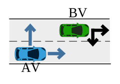

NDE/NADE Simulation
=====================
Driving intelligence tests are critical to the development and deployment of autonomous vehicles. However, due to the high dimensionality of the driving environment and the rareness of safety-critical events, hundreds of millions of miles would be required to demonstrate the safety performance of autonomous vehicles, which is severely inefficient.

In this study, we discover that sparse but adversarial adjustments to the naturalistic driving environment, resulting in NADE, can significantly reduce the required test miles without loss of evaluation unbiasedness. By training the background vehicles to learn when to execute what adversarial maneuver, the proposed environment becomes an intelligent environment for driving intelligence testing. We demonstrate the effectiveness of the proposed environment in a highway-driving simulation. Comparing with the naturalistic driving environment, the proposed environment can accelerate the evaluation process by multiple orders of magnitude.

NADE Algorithm Flowchart
-----------------------------

The algorithm flowchart of the testing process in NADE is illustrated below. 

Manuever Challenge Calculation
---------------------------------

The key of the NADE algorithm is to calculate the criticality of each vehicle at each moment. The criticality is composed by two parts

* exposure frequency obtained from naturalistic driving data,
* challenge of each maneuver.

In this study, the maneuver challenge is computed based on predicted AV manuever and one-step challenge prediction (assume car-following after one-step with off-line learned car following maneuver challenge). Specifically, the situation can be decomposed into five scenarios based on relative positions between AV and BV. Here is an illustration example for the first scenario.

In this scenario, the BV is on the adjacent lane and in front of the AV as shown below. In this case we first obtain the AV action probability using the surrogate model :func:`NADE_core._get_Surrogate_CAV_action_probability`. Let us assume the AV has the probability `P1` of turning left and `P2` of going straight. Then the critiality of the BV equals to `P1*C1 + P2*C2`, where `C1` and `C2` are manuever challenge when the AV turning left and going straight. `C1` is computed by :func:`NADE_core._hard_brake_challenge` using off-line learned car-following challenge. `C2` is computed :func:`NADE_core._cut_in_challenge` using a one-step prediceted lane-change challenge and followed by off-line learned car-following challenge.

For calculating manuever challenge in other scenarios, please refer to :func:`NADE_core.Decompose_decision`.

Usage
-------
.. code:: python3

    from core.simulator import Simulator
    from core.envs.nade import NADE
    from core.controller.vehicle_controller.NDE_NADE.nadecontroller.nadecontroller import NADEBackgroundController
    from core.conf import conf

    env = NADE(track_cav=False, BVController=NADEBackgroundController, cav_model=conf.experiment_config["AV_model"])
    sim = Simulator(
        sumo_net_file_path = './maps/3LaneHighway/3LaneHighway.net.xml',
        sumo_config_file_path = './maps/3LaneHighway/3LaneHighway.sumocfg',
        num_tries=50,
        step_size=0.1,
        sublane_flag=True,
        gui_flag=conf.simulation_config["gui_flag"],
        multistep_flag=conf.simulation_config["multistep_flag"],
        experiment_path = experiment_path,
        output = ["fcd"]
    )
    sim.bind_env(env)
    sim.run_split_single(0)

In this code, the necessary modules including simulator, environment, controller and configuration are imported. Then, a new NADE object is initialized with several settings and a simulator object is generated. After initialization, the environment object and the simulator object are binded and the simulation then starts.

Demonstration
------------------

We tested it on a three lane highway. The total length is 1200 and CAV is represented by a red vehicle, which is initialized at 400 meters from the entrance.

* **NDE**
    In the NDE scenario, all the background vehicles are controlled by NDE controller and they are set to be green.

.. video:: ../_static/nde.mp4
    :width: 800
    :height: 100

* **NADE**
    In the NADE scenario, all the background vehicles are controlled by the NDE controller except the vehicles surrounding the CAV. The vehicles, with a distance from the CAV smaller than 120 m, are controlled by the NADE controller. Most of the time, NADE controller will control the vehicles the same as the NDE controller. When there are critical maneuvers, NADE controller will send extra control commands and the controlled background vehicle will turn from green to blue.

.. video:: ../_static/nade.mp4
    :width: 800
    :height: 100